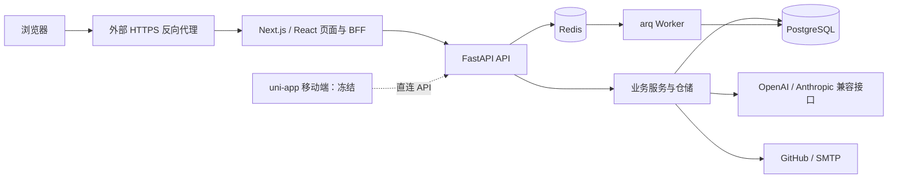

# FztbuCS 项目代码与文档审计（2026-09-18）

> 更新人：Codex（并行代码、文档审计，主审交叉核验）
> 更新日：2026-09-18
> 版本：报告 1.0
> Diátaxis：R（审计发现与验证记录）
> 适用读者：项目维护者、开发者、发布负责人
> 变更触发：本报告发现完成整改后，另附验证结果；不覆盖本次快照

本文件是**当前工作区审计快照，不是新的架构或待办单一事实源**。审计没有修改业务代码、现行文档或部署配置，没有运行发布、迁移、恢复或真实用户写操作。报告日期之后的代码变更可能使行号和结论失效。

## 1. 结论

项目已经具备清楚的模块边界、丰富的业务功能和实际可用的工程门禁，适合继续沿模块化单体演进。当前最主要的质量问题集中于**公共链路的实际行为与声明不一致**：网络失败被呈现为成功、认证轮换结果未写回、资源上传无法完成、模型用量未进入预算账本、恢复命令和发布巡检不可依赖。

因此，当前工作区**不宜直接作为新一轮生产发布候选**。下一迭代应优先完成可靠性与边界修复，再推进学习闭环、主动建议和框架迁移。这个判断来自代码、隔离复现与配置核验，不是对现网状态的判断；本次未访问现网。

| 维度 | 判断 | 依据 |
|---|---|---|
| 架构与模块组织 | 基础较好，可继续演进 | BFF / API / service / repository / PostgreSQL 边界可辨识，Alembic 管理 schema |
| 代码一致性 | 工具基础较好 | TS、ESLint、Black、Flake8、Mypy 及已有测试通过 |
| 业务正确性与安全边界 | 需要优先整改 | 普通用户可读管理统计；公开资源缺审核过滤；上传、刷新、LLM 链路存在确定缺陷 |
| 发布与恢复能力 | 当前证据不足，存在阻断缺陷 | 恢复命令失败、更新漏执行、健康检查误报、上传目录不匹配容器权限与卷 |
| 文档结构 | 覆盖广，导航和责任划分清楚 | Diátaxis 分类、根/端侧分工、ADR、原子待办与验收标准 |
| 文档可信度 | 明显落后于结构完整度 | 命令不存在、示例不符合部署、派生事实错误且检查通过、API HTML 过期 |

## 2. 项目理解与审计范围

### 2.1 当前系统

根仓是编排与跨仓协作仓库，三个源码仓库通过 Git submodule 管理。Web 是主要交付面；Mobile 已于 2026-09-14 明确冻结，不能将其未继续开发当成本轮活跃业务缺陷。

核心业务包括身份与权限（注册、登录、双 Token、2FA、RBAC）、协会运营（入社、公告、通知、活动）、社区、工具（考试、资源、任务、积分、组件注册表）、工作台与 Auxilio。Agent 已有会话分支、运行记录、轨迹、学习目标和计划等实现；“有相关表和接口”仍需与预算、失败终态、权限及用户可见行为一起验收。

前端的 BFF 已承担 Cookie、刷新、错误适配、演示降级和流式转发，实际复杂度高于简单薄转发。后端保持模块化单体合理，目前没有证据支持为解决这些缺陷而拆微服务或更换数据库。

### 2.2 基线与规模

审计基线是磁盘上的**含未提交修改的工作区**，不是某个干净提交。根仓、前后端均有用户已有修改和新增文件；报告未将这些修改误记为已发布。

| 仓库 | 当前 HEAD |
|---|---|
| 根仓 | `55ffd3d` |
| CS-Web-Backend | `9ca9e1c0c343960ec194d1352084e7ca39eec9e5` |
| CS-Web-Frontend | `15278f421e3b262c79fd2f88bc1ea20d1c7c166f` |
| CS-Mobile | `4150958513ec3f65061054afa9461aedba4caf10` |

| 范围 | 实测规模与口径 |
|---|---|
| 后端 `app/` | 229 个 Python 文件，32,335 行 |
| 前端 `src/` | 529 个 TS/TSX/CSS 文件，66,469 行；排除 `.d.ts`，包含翻译和样式 |
| Mobile `src/` | 10 个 TS/Vue/SCSS 文件，825 行；排除声明文件 |
| OpenAPI 当前基线 | 191 个 path、252 个 HTTP operation、117 个 schema |
| BFF | 153 个路由文件；前端 13 个一级业务模块 |
| 文档 | 根 docs 15 篇 / 后端 tools/docs 7 篇 / 前端 tools/docs 9 篇 / Mobile tools/docs 11 篇 Markdown |

扫描覆盖项目结构、源码、配置、测试、脚本和文档；深入检查身份、权限、数据写入、BFF、SSE/LLM、队列和运维等关键路径。文件数与行数只是范围说明，不代表逐行形式化验证。

### 2.3 实际验证结果

| 检查 | 结果 | 边界 |
|---|---|---|
| 前端 TypeScript | 通过 | Node 22.23.2，`tsc -p tsconfig.json --incremental false` |
| 前端 ESLint | 通过 | 全量 `--quiet` |
| 前端 Vitest | 37 文件、277 项通过 | 使用已安装依赖，没有连接真实后端 |
| BFF boundary / copy | 通过 | copy 为 190 行存量中文冻结基线，不代表全部文案已国际化 |
| 后端 Black / Flake8 / Mypy | 通过 | Black 351 文件；Mypy 229 源文件 |
| 后端隔离测试 | 374 通过、1 跳过 | core/middleware/security/services/schemas/api；测试 DB/Redis 显式指向 `127.0.0.1:1` |
| Alembic 脚本图 | 单 head：`b8c9d0e1f2a3` | 使用 Alembic `ScriptDirectory.get_heads()`，未连接数据库 |
| 后端 OpenAPI vs 根基线 | 通过 | 临时目录、占位环境、未启动 lifespan/数据库 |
| 根基线 vs 前端快照 | 字节一致 | 未据此推断所有手写响应适配正确 |
| 版本、模块命名、gitignore 同步 | 通过 | 根现有检查脚本 |
| 根 `make check-docs` | 退出 0 | 下文发现证明其检查范围和语义存在盲区 |
| 运维 / LLM / BFF / 上传故障复现 | 多项缺陷确认 | 临时目录、stub 网络/数据库/命令；没有调用真实部署或外部服务 |

后端现有 `.venv` 是 Python **3.14.6**，CI 为 **3.13**；前端默认 shell 的 Node 20 与 pnpm 11 不兼容，本次使用本机已有 Node 22 进行检查。建议增加项目级工具版本锁定，避免开发环境依赖全局 mise 设置。

**本次未验证**：完整 PostgreSQL/Redis 集成套件、干净 Docker 镜像构建与启动、全栈 Playwright、生产浏览器离线/换号、迁移应用与真实备份恢复、当前依赖漏洞库、现网性能与可用性。未重新测量覆盖率，不能把测试通过解释为全量 CI 或生产验收通过。

## 3. 优先修复的代码与运行问题

P1 表示应在下一次生产发布前修复；P2 表示应纳入近期迭代。标为“静态确认”的项目已有明确代码依据，但其完整环境影响没有实机重演。

### A01 · P1 · 生产故障被转换为演示登录与写入成功

位置：[backend-client.ts:289](/Users/3yearszhuang/Documents/FztbuCS-Project/CS-Web-Frontend/src/shared/backend-client.ts:289)、[demo-mode.ts:79](/Users/3yearszhuang/Documents/FztbuCS-Project/CS-Web-Frontend/src/shared/demo/demo-mode.ts:79)。

网络异常会激活进程级 30 秒演示状态，没有生产环境隔离，也不限于读取。隔离复现中，生产配置下 `POST /join` 返回 mock `201/id=99`；真实登录路由在网络失败时返回演示用户 `200`，并将演示 Token 写入认证 Cookie。申请没有入库，登录没有得到真实权限，却显示成功并可能覆盖已有会话。

**修改建议**：生产认证和写入故障返回明确失败；演示改为显式启用、独立身份和数据空间。避免一个请求失败使同进程其他用户一起进入演示。

**验收**：模拟断网、超时和后端 5xx，登录、入社、活动报名均不产生假成功、不替换真实会话；演示环境仍能独立使用。

### A02 · P1 · 资源上传从运行环境到业务落库都未闭环

位置：[resource.py:31](/Users/3yearszhuang/Documents/FztbuCS-Project/CS-Web-Backend/app/api/v1/tools/resource.py:31)、[resource.py:118](/Users/3yearszhuang/Documents/FztbuCS-Project/CS-Web-Backend/app/api/v1/tools/resource.py:118)、[tools.py:131](/Users/3yearszhuang/Documents/FztbuCS-Project/CS-Web-Backend/app/schemas/tools.py:131)、[Dockerfile:55](/Users/3yearszhuang/Documents/FztbuCS-Project/CS-Web-Backend/Dockerfile:55)、[docker-compose.yml:99](/Users/3yearszhuang/Documents/FztbuCS-Project/docker-compose.yml:99)。

- 合法上传先写文件，再构造 `resource_type="file"`；schema 不允许该值，产生内部 ValidationError，资源没有入库。临时目录复现确认文件存在、服务创建调用次数为 0。
- 客户端文件名直接作为共享存储键。两个用户上传同名 `same.pdf`，第二份覆盖第一份，即使请求最终失败也已覆盖。
- 路由模块导入时创建相对目录 `uploads/resources`。Docker `/app` 由 root 创建，运行用户为 appuser，镜像只预建可写 logs；导入路由存在启动 PermissionError。此项由 Dockerfile 与必经导入链静态确认，未构建镜像复演。
- Compose 只给 backend 挂载日志卷；前端的 `./data` 卷不保存后端上传文件。即便修复写权限，后端容器重建仍会丢失文件。

**修改建议**：统一上传领域模型；先校验再写临时对象；服务器生成不可变存储键，原文件名只用于展示；显式配置存储目录并归属后端，挂载持久卷或对象存储；数据库失败清理临时文件。文件响应与下载 URL 也应按真实传输路径联测。

**验收**：干净镜像启动；multipart 上传→审核→下载内容一致；跨用户同名不覆盖；事务失败无孤儿文件；重建容器后文件仍可下载。

### A03 · P1 · 权限与内容发布状态检查存在缺口

位置：[workbench.py:99](/Users/3yearszhuang/Documents/FztbuCS-Project/CS-Web-Backend/app/api/v1/workbench.py:99)、[rbac.py:112](/Users/3yearszhuang/Documents/FztbuCS-Project/CS-Web-Backend/app/middleware/rbac.py:112)、[resource.py:41](/Users/3yearszhuang/Documents/FztbuCS-Project/CS-Web-Backend/app/api/v1/tools/resource.py:41)、[tools_repo.py:233](/Users/3yearszhuang/Documents/FztbuCS-Project/CS-Web-Backend/app/repositories/tools_repo.py:233)。

API 使用统计仅依赖 `require_admin_2fa()`，但此依赖对非管理员直接返回，不能证明管理员权限；普通活跃用户读取全站统计的隔离 HTTP 复现返回 200。公开资源列表没有固定 approved 条件，详情也没有审核检查；匿名读取 pending 资源的隔离 HTTP 复现返回 200，并暴露本应受审核保护的内容。

**修改建议**：把“具有权限”和“管理员二次验证”组合为明确依赖；公开查询固定发布状态与安全输出字段，作者/管理员预览走独立授权入口。对考试草稿、题目详情、任务状态过滤做同类横向核查。

**验收**：匿名、普通用户、作者、管理员未完成 2FA、管理员完成 2FA 的角色矩阵；每种资源再覆盖 draft/pending/approved/rejected 状态矩阵。

### A04 · P1 · 用户自定义 LLM 地址形成 SSRF 入口

位置：[workbench.py:389](/Users/3yearszhuang/Documents/FztbuCS-Project/CS-Web-Backend/app/api/v1/workbench.py:389)、[llm_client.py:94](/Users/3yearszhuang/Documents/FztbuCS-Project/CS-Web-Backend/app/services/llm_client.py:94)。

`base_url` 只校验长度，普通用户保存非空 key 后可驱动服务器向自选地址发请求。隔离验证确认 `http://127.0.0.1:9000/internal` 被接受并构造成 `/internal/chat/completions` 请求；没有实际访问内部服务。

**修改建议**：普通用户选择获准的 HTTPS provider/host；需要私有网关时由管理员配置并显式授权。校验解析后的环回、私网、链路本地地址和 DNS 重绑定，结合出站网络限制。

**验收**：获准服务正常；未授权内网、环回、链路本地和重绑定目标被拒绝；授权私有网关有单独配置路径。

### A05 · P1 · LLM 系统提示词与成本核算未真正接通

位置：[llm_client.py:77](/Users/3yearszhuang/Documents/FztbuCS-Project/CS-Web-Backend/app/services/llm_client.py:77)、[llm_client.py:143](/Users/3yearszhuang/Documents/FztbuCS-Project/CS-Web-Backend/app/services/llm_client.py:143)、[auxilio_agent.py:647](/Users/3yearszhuang/Documents/FztbuCS-Project/CS-Web-Backend/app/services/auxilio_agent.py:647)、[auxilio.py:199](/Users/3yearszhuang/Documents/FztbuCS-Project/CS-Web-Backend/app/api/v1/auxilio.py:199)。

OpenAI 适配器接收 `system` 却没有放入请求，学习画像、角色和工具规则未送达模型；Anthropic 分支行为不同。适配器还在 `finish_reason` 时提前停止，漏掉随后 usage 尾块。即便上游直接产出 usage，Agent 循环也会忽略它，导致路由用量落库与依赖该表的每日预算失效。

这些问题已分别通过 mock 请求体、标准流尾块和独立 Agent 事件流复现，不能用修好其中一层替代整链修复。

**修改建议**：双协议采用统一契约夹具验证 system、tool_calls、usage、终止、错误和取消；读取到真正协议终止；跨工具轮累计用量并向外传播；失败/取消也结算已有用量。后续预算增加并发预留与结算。

**验收**：两种协议均收到系统上下文；多轮工具调用的 token 合计等于持久化记录；预算达到阈值后拒绝后续调用；异常终止仍留下准确运行状态和已知成本。

### A06 · P1 · Token 轮换后遇业务错误会丢失新会话凭证

位置：[backend-client.ts:279](/Users/3yearszhuang/Documents/FztbuCS-Project/CS-Web-Frontend/src/shared/backend-client.ts:279)、[backend-client.ts:425](/Users/3yearszhuang/Documents/FztbuCS-Project/CS-Web-Frontend/src/shared/backend-client.ts:425)、[server-auth.ts:50](/Users/3yearszhuang/Documents/FztbuCS-Project/CS-Web-Frontend/src/shared/server-auth.ts:50)。

401 后刷新成功、业务重试返回 403/409/422 时，代理结果有新 `authPair`，错误响应却不写 Cookie。隔离调用 `errJson` 证实 Set-Cookie 为 null。浏览器继续持有已经轮换掉的 refresh，超出后端重用宽限后会触发会话家族撤销。SSR 读取路径也主动刷新但无法回写 Cookie，需要同时修正。

**修改建议**：统一最终响应函数，成功与错误都应用认证更新；把会消费轮换 refresh 的操作放在能够写回 Cookie 的边界。

**验收**：`401→刷新成功→422→超过宽限后再次请求` 仍保持合法会话；SSR 不消耗无法保存的轮换结果；并发请求结果可预测。

### A07 · P1 · BFF 丢弃客户端元数据导致共享限流与审计失真

位置：[backend-client.ts:259](/Users/3yearszhuang/Documents/FztbuCS-Project/CS-Web-Frontend/src/shared/backend-client.ts:259)、[rate_limit.py:77](/Users/3yearszhuang/Documents/FztbuCS-Project/CS-Web-Backend/app/middleware/rate_limit.py:77)。

默认转发没有传递可信客户端 IP、User-Agent 和 Request-ID，后端按 BFF 的连接来源计限。隔离捕获证实请求携带的三个字段在上游请求中均消失。来自同一 BFF 实例的用户会共同消耗限额，设备/IP 记录和跨服务追踪也失真。

**修改建议**：由统一入口构造受信元数据白名单，并与后端可信代理范围联测；不能简单照抄浏览器提交的 `X-Forwarded-For`。

**验收**：不同真实客户端限额隔离；伪造代理头无效；同一请求前后端 trace/request ID 可关联。

### A08 · P1 · 备份恢复与回滚手册不可执行

位置：[backup_db.sh:19](/Users/3yearszhuang/Documents/FztbuCS-Project/CS-Web-Backend/tools/scripts/db/backup_db.sh:19)、[backup_db.sh:35](/Users/3yearszhuang/Documents/FztbuCS-Project/CS-Web-Backend/tools/scripts/db/backup_db.sh:35)、[RootDoc-Deploy.md:298](/Users/3yearszhuang/Documents/FztbuCS-Project/docs/RootDoc-Deploy.md:298)、[RootDoc-Deploy.md:376](/Users/3yearszhuang/Documents/FztbuCS-Project/docs/RootDoc-Deploy.md:376)。

隔离运行 `backup_db.sh --restore ...` 在任何数据库命令执行前退出 64：参数被当作目录交给 `mkdir`。此外，脚本定位的根实际为 `CS-Web-Backend/tools`；备份生成 custom archive，恢复却传给 psql；密码只赋给管道左侧 gunzip。

手册允许先删除 pgdata，再执行这个恢复路径。回滚部分还引用不存在的 `make tag`、`make pull`、`version.txt` 和 `frontend` 服务（实际为 `cs-website`）；保存的镜像与回滚使用的镜像也不对应。

**修改建议**：修正参数与根定位；用匹配归档格式的 pg_restore；先恢复到隔离新库并验证，再安排切换。发布清单记录根/子仓 SHA、镜像 digest、迁移 revision、备份 ID；回滚步骤由演练产生。

**验收**：临时新库完成备份→恢复→版本、约束、序列与关键数据核验；保留原库直到新库验证通过；应用及 schema 回滚路径明确，RTO/RPO 有实测证据。

### A09 · P1 · 更新脚本会漏更新，且迁移镜像没有跟随应用重建

位置：[update.sh:130](/Users/3yearszhuang/Documents/FztbuCS-Project/scripts/ops/update.sh:130)、[update.sh:153](/Users/3yearszhuang/Documents/FztbuCS-Project/scripts/ops/update.sh:153)、[update.sh:174](/Users/3yearszhuang/Documents/FztbuCS-Project/scripts/ops/update.sh:174)、[docker-compose.yml:106](/Users/3yearszhuang/Documents/FztbuCS-Project/docker-compose.yml:106)。

变更检测输出一行 `backend frontend`，调用者却按逐行的单个服务匹配。临时目录与 stub Docker 复现 `--no-pull` 返回 0 并声称“无服务代码变更”，Docker 调用次数为 0。双端同时变化也触发此路径。

显式更新后端/全部服务时，构建列表只含 backend/worker/cs-website，没有 migrate。Compose 为 migrate 单独构建镜像，已有部署可能继续用旧迁移镜像运行新应用。更新后的健康失败仅输出 warning，仍打印更新完成。

**修改建议**：日志与机器输出分离，服务逐行传递；检查 pull/检测失败的退出状态；后端、worker、migrate 共享同一已验证镜像 digest；显式执行迁移，再启动应用；验收失败必须非零退出。

**验收**：无变化、单端变化、双端变化、`--no-pull`、拉取失败、新迁移、健康失败均有脚本测试；部署的代码、迁移与镜像版本一致。

### A10 · P1 · 健康巡检在服务缺失或 Docker 失败时误报通过

位置：[healthcheck.sh:120](/Users/3yearszhuang/Documents/FztbuCS-Project/scripts/ops/healthcheck.sh:120)、[healthcheck.sh:146](/Users/3yearszhuang/Documents/FztbuCS-Project/scripts/ops/healthcheck.sh:146)、[health-probe.sh:26](/Users/3yearszhuang/Documents/FztbuCS-Project/scripts/ops/lib/health-probe.sh:26)。

空容器列表被判为全部正常；容器未运行时跳过探针，失败数组仍为空。使用 stub Docker 返回空列表或退出 1，`--only container,health,endpoints` 都退出 0。脚本读取 `.State` 却按 `Up...` 匹配，也没有正确区分 State/Health。前端探针依赖 curl，但镜像未安装它。

**修改建议**：检查明确预期的长期服务集合，区分一次性 migrate；用 Compose JSON 的 State/Health；命令失败、服务缺失和不健康均失败；使用镜像已有的 Node/Python 探针。

**验收**：停后端、停前端、Redis 不可达、空环境、Docker daemon 不可用都触发非零退出；正常完整栈通过。

### A11 · P2 · 事件与邮件任务的可靠执行语义不成立

位置：[events.py:69](/Users/3yearszhuang/Documents/FztbuCS-Project/CS-Web-Backend/app/core/events.py:69)、[tasks.py:37](/Users/3yearszhuang/Documents/FztbuCS-Project/CS-Web-Backend/app/core/queue/tasks.py:37)、[tasks.py:63](/Users/3yearszhuang/Documents/FztbuCS-Project/CS-Web-Backend/app/core/queue/tasks.py:63)。

`MULTI_INSTANCE=true` 时，本地先执行通知，再入队让 worker 执行同一通知，可能重复写同一数据库。arq 的单队列领取不是所有实例的广播。队列任务只调度异步 handler 就返回 delivered，副作用尚未完成，错误被吞为日志。隔离复现一次 emit 在 eager 降级下回调两次；dispatch 返回 delivered 时回调完成次数为 0。

邮件 async task 直接执行同步 SMTP，阻塞事件循环；普通 SMTP 异常没有转换为 arq.Retry，`max_tries=3` 不会自动赋予重试。真实任务 mock 抛错验证为原样异常，现有测试只验证示例任务手写 Retry。

**修改建议**：持久副作用确定唯一执行方、事件 ID 和幂等键；任务 await 完成后确认。需要事务后可靠交付时使用 PostgreSQL outbox。SMTP 放线程池或异步适配器，瞬时错误显式退避重试，永久错误直接失败。

**验收**：一次事件只有一份通知；worker 中断后可重试且不重复；Redis 短暂失败不静默丢任务；慢邮件不阻塞其他任务。默认 MULTI_INSTANCE=false 不触发重复广播问题，但异步确认与邮件问题仍需修复。

### A12 · P2 · Service Worker 缓存策略跨越身份边界

位置：[sw.js:3](/Users/3yearszhuang/Documents/FztbuCS-Project/CS-Web-Frontend/public/sw.js:3)、[sw.js:41](/Users/3yearszhuang/Documents/FztbuCS-Project/CS-Web-Frontend/public/sw.js:41)、[layout.tsx:167](/Users/3yearszhuang/Documents/FztbuCS-Project/CS-Web-Frontend/src/app/layout.tsx:167)。

非 API/Next 的 GET 全部优先使用 Cache Storage，包括注入用户数据的 HTML；登出没有清理该缓存。首页还存在固定 precache 优先于持续更新的 runtime cache 的情况。静态逻辑已确认，完整的换号/离线数据展示与旧 chunk 影响尚未用生产浏览器实测，因此本报告不声称已发生用户信息泄露。

**修改建议**：用户相关导航 HTML 不进入共享离线缓存；离线提供无身份数据的壳，静态资源版本化；明确升级及退出登录的缓存策略。

**验收**：生产构建下，A 登录→登出→B 登录→离线不会呈现 A 的资料；发布新版本后首页与 chunk 版本一致。

### A13 · P2 · SSE 续期与 BFF 错误语义不一致

位置：[backend-client.ts:329](/Users/3yearszhuang/Documents/FztbuCS-Project/CS-Web-Frontend/src/shared/backend-client.ts:329)、[assistant-chat.tsx:242](/Users/3yearszhuang/Documents/FztbuCS-Project/CS-Web-Frontend/src/modules/auxilio/ui/assistant-chat.tsx:242)、[auth/me/route.ts:18](/Users/3yearszhuang/Documents/FztbuCS-Project/CS-Web-Frontend/src/app/api/auth/me/route.ts:18)。

SSE 代理不刷新 Token，前端遇 401 只显示未登录；隔离复现有效 refresh 仍只请求一次、返回 401。其他 BFF 路由还存在把 401 标为 SERVER_ERROR、将不同错误一律转成 401、管理列表故障变 200 空列表的情况。

**修改建议**：流开始前完成一次受控刷新重试并保存 Cookie；数据流开始后不自动重放请求。统一鉴权、临时故障、校验、限流的状态语义，并传递取消信号。

**验收**：闲置后继续聊天无需重新登录；断连不会残留上游调用；无权限不显示空列表，临时故障不被当成注销。

### A14 · P2 · 公共对话框无障碍与构建证据存在小而广的缺口

位置：[modal-shell.tsx:29](/Users/3yearszhuang/Documents/FztbuCS-Project/CS-Web-Frontend/src/components/primitives/modal-shell.tsx:29)、[confirm-dialog.tsx:95](/Users/3yearszhuang/Documents/FztbuCS-Project/CS-Web-Frontend/src/components/primitives/confirm-dialog.tsx:95)、[前端 ci.yml:106](/Users/3yearszhuang/Documents/FztbuCS-Project/CS-Web-Frontend/.github/workflows/ci.yml:106)。

公共模态框缺少 dialog/aria-modal/标题关联，焦点恢复也未完整接线，影响多个使用点。CI 构建实际输出 `.build/` 与 `dist/server.js`，artifact 却归档 `.next/`，无法可靠保存构建结果。

**修改建议与验收**：先修公共原语并覆盖键盘、关闭后焦点恢复和语义测试；归档真实产物，缺文件即失败，显式处理隐藏目录与排除缓存。无需为此重写 UI 或构建系统。

## 4. 文档质量：从“结构完整”转向“操作可信”

恢复、回滚和健康验收问题已列于 A08–A10，属于文档与实现共同缺陷。其余重点如下。

| 编号 | 确认的问题 | 修改建议与验收 |
|---|---|---|
| D01 / P2 | `gen_doc_facts.py` 依赖 docstring 的 Revision ID，漏读 5 个合法迁移，报告 head=`f7a8b9c0d1e2`，真实 head=`b8c9d0e1f2a3`。`--dry-run` 只打印、不比较，两处旧 head 仍通过；多 head 还会按字典序选一个。 | 使用 Alembic ScriptDirectory 或真实 Python revision 图；漂移、多 head、缺事实源均非零退出；检查与生成复用同一差异计算。 |
| D02 / P2 | ReDoc HTML 内嵌旧契约：179 paths/98 schemas，当前为191/117；缺15条当前路径并保留3条已删除路径。 | 固定生成器版本；每次契约变更重生成；CI 比较 HTML 内嵌 spec 与当前基线，覆盖 fork/runs/goals/mistakes/plan/search。 |
| D03 / P2 | Onboarding 让用户配置后端 `.env`，启动却消费 `.env.development`；根 `.env` 初始化晚于 Compose 使用；默认 db 没有端口供宿主机后端连接。README 也残留 tmux、旧 seed/create-user 命令和 Swagger 端口混写。 | 选一条完整本地路径；开发 override 只绑定回环端口；按实际加载顺序初始化配置；用干净 checkout 从零复演。 |
| D04 / P2 | 根文档门禁不扫描前后端 tools/docs；前端有2处 RootDoc-UIStandard.md 断链；WritingGuide 分类索引大量使用作者机器 file:///Users/...，检查器直接跳过。 | 根与活跃子仓统一扫描，相对链接可移植；冻结 Mobile 显式排除；不可移植本机路径报错。 |
| D05 / P2 | 工程规范声明的版本自动写回、`make ci/docs-health`、子仓 Makefile 等能力尚不存在；AgentEval 写 P0–P2 完成，而 P2-06～08 未开始。 | 分开标注当前能力、规划、实现完成、验证完成、发布完成；命令与状态由可追溯证据支持。 |

证据入口：[gen_doc_facts.py:45](/Users/3yearszhuang/Documents/FztbuCS-Project/scripts/doc/gen_doc_facts.py:45)、[gen_doc_facts.py:215](/Users/3yearszhuang/Documents/FztbuCS-Project/scripts/doc/gen_doc_facts.py:215)、[api-reference.html:1824](/Users/3yearszhuang/Documents/FztbuCS-Project/docs/api-reference.html:1824)、[Onboarding.md:118](/Users/3yearszhuang/Documents/FztbuCS-Project/docs/Onboarding.md:118)、[check_dead_links.py:68](/Users/3yearszhuang/Documents/FztbuCS-Project/scripts/check/check_dead_links.py:68)、[RootDoc-EngConv.md:133](/Users/3yearszhuang/Documents/FztbuCS-Project/docs/RootDoc-EngConv.md:133)。

建议保留现有根/端侧所有权、ADR 和原子待办结构，减少重复维护的端口、版本、接口数量、迁移 head、测试数量。规范使用 MUST 时应明确当前对应的工具与失败条件；不存在自动化时，写清人工步骤，不先宣布已自动化。

部署文档应按“执行前条件→命令→成功输出→失败处理→回滚证据”组织。API 文档由契约生成；业务解释保留手写，但要区分当前实现与未来设计。跨仓 Aervox 评估需要固定来源 commit 与取证日期；本次没有重新审计 Aervox，不能把那份评估里的实现数量和成熟度视为当前已验证事实。

## 5. 可维护性改进顺序

1. **先收拢公共协议，再拆文件。** 将 backend-client 拆为传输、认证状态应用、类型化响应适配；Agent 拆为模型适配、工具循环、用量结算、运行记录。保持对外接口稳定，用行为测试保护改动。
2. **明确事务所有者。** 由业务用例管理事务，repository 不随意逐条提交。考试批量建题/答题、任务提交/积分奖励、通知等优先核查原子性与幂等，再做机械拆分。
3. **让契约参与编译。** 当前生成类型与基线同步是好基础，但大量 BFF 仍依赖 Record/断言；按 OpenAPI operation 关联请求、成功响应、分页和错误映射。
4. **补跨层行为测试，而非堆数量。** 当前前端覆盖率配置地板仅 lines14%、branches10%（配置值，非本次实测）。优先覆盖本报告触发链，再逐步抬高关键模块阈值，避免先设不现实全仓百分比。
5. **固定开发与发布输入。** 项目级工具版本、同一构建产物、子仓 SHA、迁移版本和 smoke 结果一起进入发布清单。新增轻量 PR smoke，重型全栈测试继续按成本安排 nightly。

较大的维护热点：后端 user_service 859 行、Auxilio 路由792行、auth_service784行、auxilio_service780行、auxilio_agent720行；前端 backend-client707行、archive-index676行，另有大型 CSS/翻译文件。行数用于寻找责任混合点，不能直接作为“代码差”的证据；翻译表尤其不应按业务复杂度评价。

## 6. 下一轮迭代建议

### 6.1 下一迭代：只交付“可靠发布候选”

建议拆成五个可独立审查的修复包，按依赖推进；时间以负责人和验收环境确认后估算。

| 修复包 | 交付范围 | 完成标准 |
|---|---|---|
| R1：身份与真实结果 | A01/A03/A06/A07；同时统一关键 BFF 错误 | 普通用户权限矩阵、故障不假成功、刷新后错误不掉线、可信 IP 联测通过 |
| R2：资源完整链路 | A02及公开审核边界 | 容器启动、上传、审批、下载、失败清理、同名并发与持久化通过 |
| R3：模型执行可信度 | A04/A05/A13 | 出站地址约束、双协议一致、usage结算、预算、SSE续期与取消通过 |
| R4：发布与恢复 | A08/A09/A10/A11中的任务可靠性 | 新库恢复演练、应用/迁移同镜像、更新脚本失败退出、故障巡检、通知幂等通过 |
| R5：文档与交付证据 | D01–D05、A12/A14 | 干净环境教程通过，生成事实/链接门禁有效，产物正确，生产缓存与键盘流程验证 |

跨仓改动应先提交并验证子仓，再让根仓指向确切提交，同时同步契约与发布清单。不要仅记录根仓 SHA，也不要在当前用户未提交修改上直接发布。

### 6.2 后续产品迭代：完成一个可度量的学习闭环

优先把“考试或错题→薄弱点→有解释的资源/计划→专注执行→复习反馈”串成一个可用流程。先完成 AG-P2-06 推荐解释与反馈、AG-P2-08 隐私面板，再根据实际使用决定 AG-P2-07 练习生成；练习始终是有明确 AI 标识的草稿。

建议记录闭环完成率、建议接受/忽略比例、任务完成率、每次有效建议的模型成本、失败率，以及用户纠正/删除是否生效。先形成基线再设目标，不凭接口和页面数量宣布用户价值达成。

### 6.3 再推进 Agent 主动能力与技术迁移

Agent 下一步先做可忽略、可关闭、可追溯来源的 Inbox 纵向切片，再增加每日建议和自动化。只读建议可以先行；涉及写个人数据、共享内容或外部消息时，必须先交付对应 Skill 风险分级、参数绑定的审批、幂等执行和审计，不能机械地等到路线表 P5 才补这些前置能力。

已有 Vue/Nuxt 迁移文档可保留为方案，当前阶段不建议与可靠性修复、Agent 新能力并行展开全面重写。先用修复后的契约与行为测试形成框架无关资产；若迁移确有团队、维护成本或产品收益，再选单一低风险模块验证双框架 Cookie、路由分流、SSR、SSE 和构建证据，按可回滚切片推进。

MCP 互联可在只读学习数据稳定后小范围验证。Mobile 保持冻结；未来解冻时再一次性补登录2FA、登出refresh撤销、安全存储、部署域名、契约覆盖和CI，而不是现在为三端形式统一分散投入。

## 7. 建议采用的完成定义

下一次将条目标记“完成”时，至少同时记录：代码和契约版本、成功路径、失败/权限/并发路径、运行环境、可重复的检查命令、验收结果、已知限制。发布与恢复类工作另附演练记录；没有演练的能力保持“已实现/待验证”。

本次最有价值的后续工作是把 A01–A10 的复现条件变成持续回归检查，并用一次隔离的完整发布与恢复演练检验修复结果。结构整理、文档扩写和新功能应服务于这些可观察结果。
