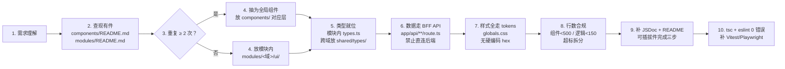
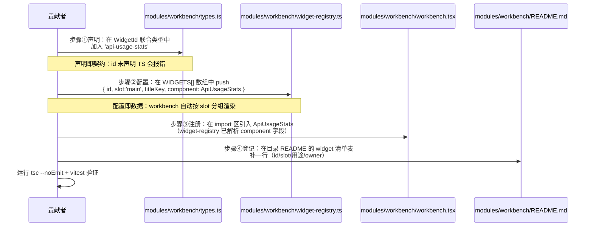
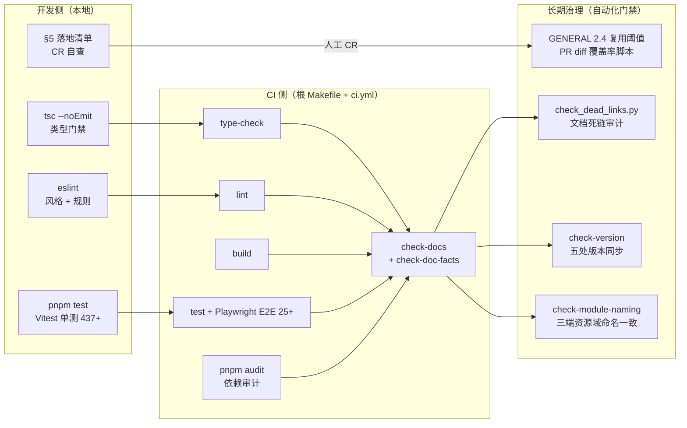

# RootDoc-FEArch｜前端工程方法论

> 更新人：3yearsZ
> 更新日：2026-08-20
> 版本：1.0.1
> Diátaxis：E（Explanation·解释）+ L3（Arc42 方法论适配版）
> 适用读者：前端开发者、组件设计者、架构评审者、新成员前端入职

读完本文，你将理解本项目前端的**工程组织哲学**——组件如何分层、目录如何收口、复用阈值如何量化、样式如何克制、协作约束如何落地。架构事实见 [`FrontDoc-01-Arch.md`](file:///Users/3yearszhuang/Documents/FztbuCS-Project/CS-Web-Frontend/tools/docs/FrontDoc-01-Arch.md)，编码规范见 [`FrontDoc-03-Conv.md`](file:///Users/3yearszhuang/Documents/FztbuCS-Project/CS-Web-Frontend/tools/docs/FrontDoc-03-Conv.md)，视觉与交互规范见 [`FrontDoc-UID.md`](file:///Users/3yearszhuang/Documents/FztbuCS-Project/CS-Web-Frontend/tools/docs/FrontDoc-UID.md)，通用工程规范见 [`RootDoc-EngConv.md`](file:///Users/3yearszhuang/Documents/FztbuCS-Project/docs/RootDoc-EngConv.md)。

---

## 1. 目标与约束

### 1.1 方法论目标（为什么需要这套秩序）
本方法论解决前端工程 3 类长期痛点：
1. **可维护性**：每一次新增都落在既定格子里，避免「项目越做越乱」
2. **一致性**：三端同名同构、组件复用不散落、样式不靠 `!important` 强权
3. **协作效率**：新成员 30 分钟理解目录秩序；AI 协作有硬性红线不跑偏

### 1.2 设计哲学（三句话）
1. **内容按「原子 → 有机体」生长**：UI 从最小不可分单元组合出来，而非从页面反向切碎。
2. **目录按「职责 → 模块」收口**：每个目录有且只有一个明确的职责边界。
3. **配置按「单块 → 聚合」暴露，样式按「变量 → 优先级」克制**：配置即数据，样式不靠强权。

### 1.3 技术约束（不可逆）
| 约束 | 说明 |
|------|------|
| 定位 | 本文件为 **CS-Web-Frontend（Next.js 16 App Router BFF 薄转发层）专属方法论**，不是通用前端准则；所有示例以本仓库真实代码为锚 |
| 状态 | hooks + SWR + localStorage；**禁止全局事件总线**（遗留已删） |
| 数据访问 | 统一 `shared/backend-client.ts` + BFF API 路由；**禁止组件直 `fetch` 后端** |
| 样式 | Tailwind + `globals.css` 设计令牌；**禁止散落硬编码 hex**；**禁用 `!important`**（第三方注入例外须集中审批） |
| 技术栈 | Next.js 16 App Router + React 19 + TS 5.5（strict:true）；锁包管理器 pnpm（packageManager 字段） |
| 测试 | Vitest 单测 + Playwright E2E；拆分必须补测 |

### 1.4 质量目标优先级
1. **一致性**（P0）：组件分层 / 命名 / 样式全仓库统一，不允许同功能多份实现
2. **可维护性**（P0）：组件 < 500 行、逻辑 < 150 行，超标强制拆分
3. **可复用性**（P1）：重复 ≥ 2 次 MUST 抽取原子件；先查现有件再新建
4. **可读性**（P1）：目录 README + JSDoc 头注释 + 配置表说明，命名即文档

---

## 2. 上下文与范围

### 2.1 方法论 ↔ 规范 引用桥（本文档的分工定位）
本文档回答「**怎么组织**」；规范文档回答「长什么样 / 事实是什么」。二者互不重复，交叉引用如下：

| 本文档（方法论·怎么组织） | 落点规范（事实 / 视觉） |
|---|---|
| §3.1 分层即内容（五层 + 业务域） | `FrontDoc-UID.md §5.0` 组件体系；`FrontDoc-03-Conv.md §7` 复用契约；`components/README.md` |
| §3.3 配置即内容数据 | `FrontDoc-01-Arch.md §3.5` widget-registry；`FrontDoc-03-Conv.md §8` 注册表；`FrontDoc-UID.md §4.8` capsule-tabs |
| §3.5 样式内容法则 | `FrontDoc-03-Conv.md §5` 样式令牌；`FrontDoc-UID.md §1` 颜色 / `§3.5` Token 表；`src/app/globals.css` |
| §3.4 项目骨架 | `FrontDoc-01-Arch.md §3` 构建块视图 + 完整目录树 |
| §3.6 模块化三条规则 | `FrontDoc-01-Arch.md §3.2` 10 个业务模块速览；`modules/README.md` |
| §6 协作约束（前端特有） | `RootDoc-EngConv.md §八` 通用禁令；`FrontDoc-03-Conv.md §1` 分层铁律 |

> 新增页面 / 组件完整接入流程见 `docs/Onboarding.md` 附录 A。

### 2.2 上游（调用方 = 文档使用者）
| 角色 | 用本文件做什么 |
|------|---------------|
| 前端贡献者 | 新建组件/页面时，确定放置位置、复用阈值、命名规范 |
| AI 协作 Agent | 遵守 §6 强约束，不擅自新建目录/复用已知组件 |
| Code Reviewer | 对照 §5 落地清单 + §6 协作约束做 CR 门禁 |
| 新成员入职 | 30 分钟快速理解目录秩序与设计哲学 |

### 2.3 下游（被调用方 / 关联文档）
见上方「方法论 ↔ 规范引用桥」6 组交叉引用。

### 2.4 不在范围内
- **不包含架构事实**（Next.js 四层结构、BFF 前缀映射、模块依赖图）：见 `FrontDoc-01-Arch.md`
- **不包含视觉令牌**（颜色/圆角/阴影/z-index 具体值）：见 `FrontDoc-UID.md`
- **不包含编码细则**（JSDoc 格式、import 顺序、lint 规则）：见 `FrontDoc-03-Conv.md`
- **不包含通用工程禁令**（最小范围、禁止炫技等）：见 `RootDoc-EngConv.md §八`

---

## 3. 构建块视图（核心：组织秩序的积木）

### 3.1 分层即内容（Atomic Design 落地：五层 + 业务域）
本项目组件按**五层 + 业务域**组织，**绝不按文件后缀**（`.tsx` / `.ts` / `.css`）分组：

| 层级 | 目录 | 定义 | 本项目代表 |
|------|------|------|------|
| **primitives**（atoms） | `components/primitives/` | 无业务语义的通用原子件 | `button` `input` `spinner` `loading` `section-nav` `inline-tabs` `filter-bar` `confirm-dialog` |
| **layout**（organisms） | `components/layout/` | 页面级骨架与导航 | `navbar` `footer` `collapsing-hero` `floating-capsule-sidebar` |
| **effects** | `components/effects/` | 入场 / 过渡动效原语 | `motion-primitives` `mobius-ring` `page-transition` `scroll-indicator` |
| **feedback** | `components/feedback/` | 加载 / 空 / 错 / 成功四态 | `toast` `empty-state` `fallback` `announcement-banner` |
| **根级 root-level** | `components/`（顶层） | 跨页面全局件 | `avatar` `user-menu` `notification-bell` `theme-provider` `tech-tag-selector` |
| **features**（业务域） | `modules/*/` | 特定功能集合（`types/` + `ui/`） | `auth` `community` `events` `tools` `workbench` … |

**黄金法则**：写新 UI 前先查现有原子件（`components/README.md` 清单）；不存在且满足「重复 ≥ 2 次 / 职责单一 / 可独立存在 / 可配置化」才新建。

### 3.2 复用阈值（量化红线 · 必须执行）
| 信号 | 阈值 | 动作 |
|------|------|------|
| 重复 UI 结构 | ≥ 2 次 | 抽取为 primitives 原子件（`GENERAL 2.4`，见 `components/README.md`） |
| 组件总行数 | > 500 | 必须拆分 |
| 样式代码 | > 200 行 | 拆出 / 提取设计令牌 |
| 逻辑代码 | > 150 行 | 提为 hook / util |
| 状态变量 | > 10 个 | 拆子组件 + 状态管理 |
| 导入依赖 | > 10 个 | 提取服务层 |

**拆分四法**：按功能 / 按 UI 层级 / 按关注点 / 提取通用容器。

### 3.3 内容边界契约 + 配置即数据
**边界契约**：
- **展示组件** 与 **容器/数据逻辑** 分离：UI 组件只管渲染，数据获取抽 `shared/hooks/`、模块内 `ui/hooks/` 或 BFF 层
- **同名组件绝不散落多目录**（反例：同一组件在 `components/`、`modules/x/ui/`、`app/*/` 各一份）
- 业务数据一律经 BFF API（`src/app/api/**/route.ts` → `backend-client.ts`），**禁止**组件直连后端

**配置即内容数据**：
- 运行时消费的「组件清单 / 功能开关」派生为聚合对象，**配置驱动渲染**
- 本项目实例：
  - `shared/config/`：`avatar-presets` / `admin-avatars` / `header-images` / `auth-constants`
  - `modules/workbench/widget-registry.ts`：widget 声明数组（id/slot/titleKey/component），按 slot 分组渲染
  - `tools/docs/capsule-tabs.md`：各页面悬浮胶囊 Tab 配置表
- 配置入口用 ASCII 表 / 注释说明每个导出项

### 3.4 目录设计艺术：项目骨架 + 组织原则
**核心原则：按职责分层，拒绝技术分层。**
```text
❌ app/ components/ utils/          ← 按类型机械分组（拒绝）
✅ app/ components/ modules/ shared/ ← 按职责分组（采用）
```

**复杂组件 = 子目录即模块**（每个复杂组件自带 hooks/types/constants）：
```text
modules/workbench/widgets/pomodoro/
├── pomodoro-player.tsx   # 组合件：番茄钟 + 播放器（< 500 行）
├── use-pomodoro.ts       # 状态机（focus/shortBreak/longBreak）
├── music-panel.tsx       # 上传音乐（IndexedDB）
├── settings-panel.tsx    # 配置面板
└── constants.ts          # SVG stroke 色板（集中收口）
```
深层引用用路径别名 `@/` 消除；目录级 `index.ts` 桶导出。

**模块化三条规则（业务域主线）**：
1. 只在 ≥ 2 个业务域都用时，才提进 `components/`（根级或 primitives）
2. 域内有复用，就在域内建子目录，不往外推
3. 每域自带 `types/`，自包含不依赖外域

> 项目**真实完整目录树**权威为 `FrontDoc-01-Arch.md §3.3`。

### 3.5 样式内容法则
- **禁用 `!important`**（仅第三方注入样式例外，且须集中、须审批）
- **覆盖优先级链**（从高到低尝试，`!important` 为末位手段）：
  1. 原子类 / 工具类（Tailwind 任意值 `text-[var(--primary)]`）
  2. 提高选择器特异性
  3. 设计令牌（CSS 变量，`globals.css` 集中定义）
  4. 组件作用域样式
  5. 全局样式（谨慎）
  6. `!important`（禁止常规使用）
- 主题切换一律走 CSS 变量（`:root` 浅色 / `.dark` 深色）
- 颜色 / 圆角 / 阴影 / z-index / 动效时长全部走 `globals.css` token，**禁止散落硬编码 hex**

### 3.6 接入仪式（防「配置了不显示/注册了不生效」）
新增可插拔模块（widget、侧边栏组件、路由、Provider），**声明 → 配置 → 注册 三处缺一不可**：
1. **声明**：类型 / 接口中声明（如 widget 类型）
2. **配置**：配置文件中启用并排位（如 `widget-registry.ts` 的 `WIDGETS[]`）
3. **注册**：在注册表 / 渲染器中登记（多入口相互独立，勿只登一处）

> 落地实例：`FrontDoc-01-Arch.md §3.5` 新增 widget 三步；`FrontDoc-UID.md §4.8` 新增页面同步 capsule-tabs。

### 3.7 命名即文档
| 类型 | 格式 | 示例 |
|------|------|------|
| UI 组件 | `PascalCase.tsx` | `Button` `SearchBar` |
| Hook | `useXxx.ts` | `useCollapsingHero` `usePomodoro` |
| 工具函数 | `[功能]-utils.ts` | `event-date` `pagination` |
| 类型定义 | `types.ts`（模块内）或 `shared/types/` | `role-types` `user-types` |
| 路由 | `[name]` / `[param]` / `[...catch-all]` | `index` `[slug]` `[category]` |

### 3.8 文档伴随代码
- 目录级 `README.md` 列清组件清单与分类原则：`components/README.md`、`modules/README.md`、`modules/workbench/README.md`
- 每个组件 / 页面必须有 JSDoc 头注释（格式见 `FrontDoc-03-Conv.md §6`）
- 配置入口用表 / 注释说明每个导出

---

## 4. 运行时视图（方法论的落地流程）

> Arc42 「运行时」适配为本方法论的**真实执行流程**：即一名贡献者从「要加功能」到「合入主干」的完整工作流，按本方法论的约束应如何执行。

### 4.1 场景 1：新增一个页面（完整 10 步 Checklist 流程）


### 4.2 场景 2：新增工作台 Widget（接入仪式三步的实例化）


### 4.3 场景 3：样式覆盖的优先级决策树
```mermaid
flowchart TD
    A[需要覆盖第三方/默认样式] --> B{能否用 Tailwind 原子类<br/>+ 任意值？}
    B -->|能| C[用 text-[var(--primary)]<br/>/ rounded-[12px] 解决]
    B -->|不能| D{能否提高<br/>选择器特异性？}
    D -->|能| E[加父选择器限定范围<br/>.my-wrap .third-party {}]
    D -->|不能| F{能否用<br/>CSS 变量覆盖？}
    F -->|能| G[在 globals.css 对应 scope 下<br/>--token: 新值]
    F -->|不能| H{是否第三方<br/>注入样式？}
    H -->|是| I[集中写一处 !important<br/>+ 须审批 + 注释说明 WHY]
    H -->|否| J[重写为组件级样式<br/>或提交到组件库修正]
```

---

## 5. 部署视图（方法论的工程化闭环）

> Arc42 「部署视图」适配为方法论的**工程化持续保障机制**：即如何通过 CI / 测试 / 状态管理 / 依赖锁等手段，保证本方法论不随时间腐化、红线不被突破。

### 5.1 工程化保障拓扑


### 5.2 状态管理的工程化铁律
| 状态类型 | 承载位置 | 禁止做法 |
|---------|---------|---------|
| 服务端状态 | SWR（`swr-provider`）+ 自动 revalidate | 禁止手工轮询 / 禁止全局事件总线同步 |
| UI 交互状态 | hooks（`useState` / `useReducer`） | 禁止为了「方便共享」抽 Redux |
| 本地持久化（用户偏好） | `localStorage` + 封装 hook | 禁止散落 `localStorage.*` 直调 |
| Widget 显隐等工作台偏好 | `wb_widget_prefs` key（已约定） | 禁止新 key 不登记在 README |

**现状事实**：无 `stores/` 目录、无全局事件总线（遗留 `event-bus.ts` 已 0 引用待删）。

### 5.3 测试工程化矩阵
| 测试类型 | 框架 | 规模 | 触发时机 | 方法论关联 |
|---------|------|------|---------|-----------|
| 单元测试（hooks/utils/components） | Vitest | 437+ | 每次 PR + 本地 `pnpm test` | 拆分组件 MUST 补测；覆盖复用阈值 |
| E2E 关键路径（登录/报名/工作台） | Playwright | 25+ | CI + 发布前手动 | 核心路径回归，与 §4.1 场景对应 |
| 视觉回归（组件 PR） | Playwright snapshot 可选 | - | UI 组件 PR | 复用阈值下的组件不允许视觉漂移 |
| 类型测试 | `tsc --noEmit` + strict:true | 全量 | 每次保存 + CI | §3.7 命名即文档的 TS 强制保障 |
| 依赖审计 | `pnpm audit` | 全量 | CI 每日 + 发布前 | §6.4 禁止未声明依赖 / 同类多库并存 |

### 5.4 扩展与腐化的防御策略
- **目录嵌套 ≤ 3 层**：深路径用 `@/` 别名消除，防「路径地狱」
- **扁平优先，勿过度嵌套**：为分层而分层 = 反模式
- **锁包管理器**：`package.json` `packageManager` 字段固定 pnpm；防 npm/yarn 混用
- **命名即文档**（§3.7）：目录/文件命名清晰，代码内注释只补「WHY」不写「WHAT」

---

## 6. 架构决策（ADR 摘要 · 方法论的取舍速查）

| 编号 | 决策内容（本项目怎么做） | 被否决的替代方案（规避什么反模式） | 选择理由 |
|------|------------------------|---------------------------------|---------|
| ADR-FE1 | 按职责分层（app/components/modules/shared） | 按技术分层（components/utils/styles 大海） | 每个目录一个职责边界；贡献者一眼知道代码放哪 |
| ADR-FE2 | 五层全局组件体系（primitives/layout/effects/feedback/root-level）+ 业务域 features | 扁平 `components/` 大海 / 按页面散放组件 | 复用阈值量化锚定；跨页复用件天然集中 |
| ADR-FE3 | 重复 ≥ 2 次即抽取（GENERAL 2.4 量化红线） | 「先复制一份再说」/ 「等第 3 次再抽」 | 复制粘贴是技术债务起点；≥2 阈值成本最优 |
| ADR-FE4 | 复杂组件 = 子目录即模块（自带 hooks/types/constants） | 单文件几千行 / 扁平一堆散乱小文件 | 自包含、易测试、引用路径用别名消除 |
| ADR-FE5 | 样式令牌集中 + `!important` 禁用 + 优先级链 6 步 | 散落硬编码 hex / `!important` 强权覆盖 | 设计系统一致；主题切换天然支持；排错路径清晰 |
| ADR-FE6 | 可插拔件「声明 → 配置 → 注册」三步缺一 | 「只 import 一下就行」/ 多入口只登一处 | 防「配了不显示/换了不生效」；新人 CR 可对账 |
| ADR-FE7 | 状态 = hooks + SWR + localStorage，不建 stores/ | Redux / MobX / Zustand 全局状态 | 本项目无跨域复杂交互；BFF 权威 + SWR revalidate 足够；减少心智负担 |
| ADR-FE8 | 数据访问统一走 `backend-client.ts` + BFF API | 组件直 `fetch` / 散落在 `services/` | 三层职责（JWT 注入/401 刷新/snake→camel）集中实现；修改一次全网生效 |
| ADR-FE9 | 目录 README + JSDoc 头注释 + 配置表三件套 | 只写代码不写「为何」 | AI 协作可理解上下文；新人 30 分钟上手；CR 有据可依 |
| ADR-FE10 | §6 协作约束强约束（前端特有硬红线） | 完全依赖「大家自觉」/ 「写得好就行」 | AI 协作下必须有硬门禁；代码风格一致性不依赖个人品味 |

---

## 7. 风险与技术债务（方法论的落地风险）

### 7.1 已知落地风险
| 风险 | 影响 | 缓解措施 |
|------|------|---------|
| 复用阈值被突破（组件复制粘贴不抽取） | P1：组件三份以上漂移，修一个 bug 改多处 | CR 对照 §3.2 红线；依赖审计脚本告警（同名 JSX 结构 hash 重复） |
| 业务组件硬编码 hex 颜色 / `!important` 强权 | P1：设计系统失效，主题切换不可用 | eslint 自定义规则 + 代码搜索正则；`globals.css` grep 不到 hex 即通过 |
| 可插拔件漏做「三步」导致不显示 | P2：新人贡献者 debug 半天找不到原因 | §4.2 时序图进入 Onboarding；widget-registry TS 类型强制 + 运行时 dev 模式告警 |
| AI 协作擅自新建目录 / 拆分文件 | P0：目录秩序被 AI 增量破坏 | §6 强约束硬注入 Agent System Prompt；每次修改先列计划文件 + 改动点（§6.6.1） |

### 7.2 技术债务（方法论层面的已知违反项）
| 债务 | 位置 | 严重度 | 计划偿还 |
|------|------|--------|---------|
| `/events/[id]` 活动详情页裸 `ReactMarkdown`，**未走** `rehype-sanitize` 统一过滤链（违反 ADR-FE5 统一安全机制） | `modules/events/ui/event-detail-page.tsx` | P1 XSS 风险 | 下个迭代替换为 Markdown 三层继承链（Renderer→Base→Editor） |
| `shared/events/event-bus.ts` 全局事件总线遗留（已 0 引用，但未删除；违反 ADR-FE7 无 stores/ 铁律） | `shared/events/event-bus.ts` | P3 死代码 | 下次清理迭代安全删除并同步 ESLint no-restricted-imports |
| GENERAL 2.4 复用阈值 PR diff 覆盖率脚本尚未自动化（当前 CR 人工肉眼对比） | `scripts/check/` 缺口 | P2 | 下一迭代写 `scripts/gate/check-reuse-threshold.py`：PR diff 中同 JSX 结构 ≥ 2 即提醒 |
| `api-usage-stats` 工作台 widget 后端就绪，前端组件 `WIDGETS[]` 未注册（违反接入仪式三步） | `modules/workbench/widget-registry.ts` | P1 W-3 待办 | 组件写完后严格按 §3.6 三步登记 |
| dev-docs 路径穿越防护 BFF 本地实现，未对齐 `RootDoc-Sec.md` 基线（违反 ADR-FE8 统一安全层） | `src/app/api/dev-docs/**/route.ts` | P2 | 下次重构加白名单 slug 正则 + 路径归一化判断 |

---

## 8. 术语表

| 术语 | 定义 |
|------|------|
| 五层组件体系 | primitives / layout / effects / feedback / root-level + 业务域 features（modules/*）。不按文件后缀分组，按职责分层 |
| GENERAL 2.4 | 复用阈值编号：重复 UI 结构 ≥ 2 次 MUST 抽取为 primitives 原子件 |
| 目录即模块 | 复杂组件以子目录为单位，自带 hooks/types/constants/index.ts，而非单文件膨胀 |
| 桶导出 | 目录级 `index.ts` 统一 export，引用方 `@/modules/x/ui` 无需写深层路径 |
| 接入仪式三步 | 新增可插拔模块 MUST 完成：声明（类型）→ 配置（排位）→ 注册（渲染器） |
| 设计令牌 | `globals.css` 中集中定义的 CSS 变量：颜色 / 圆角 / 阴影 / z-index / 动效时长 |
| 覆盖优先级链 6 步 | 从 Tailwind 任意值 → 特异性 → CSS 变量 → 作用域 → 全局 → `!important`（末位） |
| 三件套文档 | 目录级 README + 组件 JSDoc 头注释 + 配置表注释说明每个导出 |
| 业务域主线模块化三规则 | 跨域复用才升全局 / 域内复用域内建 / 每域自带 types，自包含 |
| 协作约束 §6 | 前端特有硬性红线：目录文件 / 组件 / 代码风格 / 依赖 / 修改范围 / 输出要求 六节 18 条 |
| CSS 变量主题切换 | `:root` 浅色令牌 + `.dark` 深色令牌；运行时切换 `<html>` class 即生效，无需 `!important` |

---

## 附录 A：落地清单（新增页面 / 组件开局 Checklist）

> 摘自 §4.1 流程。贡献者合入前 MUST 全勾选。

- [ ] 先查 `components/README.md` + `modules/README.md` 现有件，满足「重复 ≥ 2 次」才新建
- [ ] 全局件放 `components/{primitives,layout,effects,feedback}` 或根级；业务件放 `modules/<域>/ui/`
- [ ] 类型放模块内 `types.ts`，跨域类型放 `shared/types/`
- [ ] 数据一律走 BFF API（`app/api/**/route.ts`），**禁止**组件直连后端
- [ ] 颜色 / 圆角 / 阴影 / z-index / 动效全走 `globals.css` token
- [ ] 组件 < 500 行、逻辑 < 150 行（超则拆 hook / 子组件）
- [ ] 补 JSDoc 头注释（`FrontDoc-03-Conv.md §6`）+ 目录 README 登记
- [ ] 可插拔件完成「声明 → 配置 → 注册」三步（§3.6）
- [ ] `tsc --noEmit` + `eslint` 0 错误，涉及交互补 Vitest / Playwright
- [ ] 视觉规范自查：对照 `FrontDoc-UID.md §12` 新增页面 Checklist

---

**一句话内核**：*内容按「原子 → 有机体」生长，目录按「职责 → 模块」收口，配置按「单块 → 聚合」暴露，样式按「变量 → 优先级」克制。*
